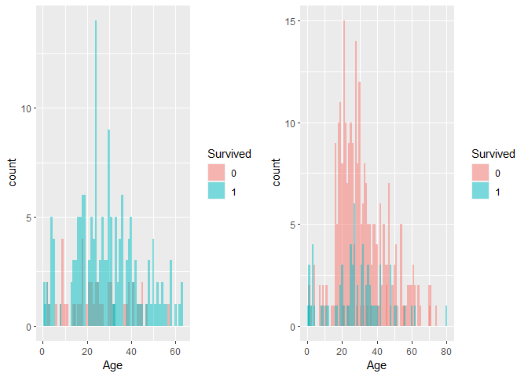
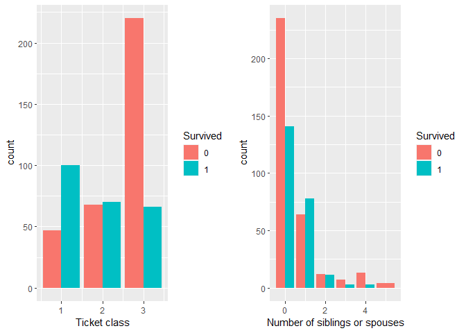

Binary Classification
================
2023-05-07

- <a href="#load-data" id="toc-load-data">Load data</a>
- <a href="#data-exploration" id="toc-data-exploration">Data
  exploration</a>
- <a href="#logistic-regression" id="toc-logistic-regression">Logistic
  regression</a>

# Load data

``` r
library("rmarkdown")
```

    ## Warning: package 'rmarkdown' was built under R version 4.2.3

``` r
setwd("C:/Users/Noah/Desktop/Github files/Data/")
Titanic <- read.csv("C:/Users/Noah/Desktop/Github files/Data/Titanic.csv")
```

Since PassengerID is unique for each person we will drop it, we also
will not need Name, Fare, Embarked, and Ticket, since these will not
determine a persons survival. Cabin also contains a large number of NAs
so it will be dropped as well.

``` r
library(dplyr)
```

    ## Warning: package 'dplyr' was built under R version 4.2.2

    ## 
    ## Attaching package: 'dplyr'

    ## The following objects are masked from 'package:stats':
    ## 
    ##     filter, lag

    ## The following objects are masked from 'package:base':
    ## 
    ##     intersect, setdiff, setequal, union

``` r
Titanic <- data.frame(Titanic) %>% select( Survived, Pclass, Age, Sex, SibSp, Parch)
```

``` r
Titanic$Survived<- as.factor(Titanic$Survived)
Titanic$Sex<- as.factor(Titanic$Sex)
Titanic <- subset(Titanic, !is.na(Age))
summary(Titanic)
```

    ##  Survived     Pclass           Age            Sex          SibSp       
    ##  0:424    Min.   :1.000   Min.   : 0.42   female:261   Min.   :0.0000  
    ##  1:290    1st Qu.:1.000   1st Qu.:20.12   male  :453   1st Qu.:0.0000  
    ##           Median :2.000   Median :28.00                Median :0.0000  
    ##           Mean   :2.237   Mean   :29.70                Mean   :0.5126  
    ##           3rd Qu.:3.000   3rd Qu.:38.00                3rd Qu.:1.0000  
    ##           Max.   :3.000   Max.   :80.00                Max.   :5.0000  
    ##      Parch       
    ##  Min.   :0.0000  
    ##  1st Qu.:0.0000  
    ##  Median :0.0000  
    ##  Mean   :0.4314  
    ##  3rd Qu.:1.0000  
    ##  Max.   :6.0000

``` r
set.seed(222)
index<-sample(nrow(Titanic),0.8*nrow(Titanic),replace = FALSE)
train<-Titanic[index,]
test<-Titanic[-index,]
```

# Data exploration

``` r
library(ggplot2)
```

    ## Warning: package 'ggplot2' was built under R version 4.2.2

``` r
library(cowplot)
```

    ## Warning: package 'cowplot' was built under R version 4.2.2

``` r
female <- ggplot(data = subset(train, Sex == "female"), aes(x = Age, fill = Survived))+
  geom_bar(position = "identity", width = 1, alpha = 0.5)
male <- ggplot(data = subset(train, Sex == "male"), aes(x = Age, fill = Survived))+
  geom_bar(position = "identity", width = 1, alpha = 0.5)

plot_grid(female, male)
```

<!-- -->

On the Titanic a persons chance of surviving was definitely related to
their sex, however there was an age component as well. Men around age 30
had the highest number of deaths on the Titanic based on these plots.

``` r
class <- ggplot(train, aes(Pclass, fill = Survived))+
  geom_bar(position = "dodge")+
  xlab("Ticket class")

siblings <-ggplot(train, aes(SibSp, fill = Survived))+
  geom_bar(position = "dodge")+
  xlab("Number of siblings or spouses")

plot_grid(class, siblings)
```

<!-- -->

Here we see that the ticket class also had an important role in if the
passenger survived. Far more third class passengers died than survived.
We can also see that people with more siblings or spouses were less
likely to survive.

# Logistic regression

``` r
titanic_glm <- glm(Survived ~ Sex, data = train, family = 'binomial')
summary(titanic_glm)
```

    ## 
    ## Call:
    ## glm(formula = Survived ~ Sex, family = "binomial", data = train)
    ## 
    ## Deviance Residuals: 
    ##     Min       1Q   Median       3Q      Max  
    ## -1.7263  -0.6649  -0.6649   0.7146   1.7988  
    ## 
    ## Coefficients:
    ##             Estimate Std. Error z value Pr(>|z|)    
    ## (Intercept)   1.2347     0.1640   7.529  5.1e-14 ***
    ## Sexmale      -2.6315     0.2109 -12.480  < 2e-16 ***
    ## ---
    ## Signif. codes:  0 '***' 0.001 '**' 0.01 '*' 0.05 '.' 0.1 ' ' 1
    ## 
    ## (Dispersion parameter for binomial family taken to be 1)
    ## 
    ##     Null deviance: 774.32  on 570  degrees of freedom
    ## Residual deviance: 583.93  on 569  degrees of freedom
    ## AIC: 587.93
    ## 
    ## Number of Fisher Scoring iterations: 4

``` r
predict_survived_from_sex <- predict(titanic_glm,newdata = test,type = 'response') 
# Since Survived can only be either 1 or 0, write if statement to round up of down the response
predict_survived_from_sex <- ifelse(predict_survived_from_sex>0.5,1,0)
error_1 <- mean(predict_survived_from_sex!=test$Survived)
accuracy_1 <- 1-error_1
accuracy_1
```

    ## [1] 0.7342657

This model predicts survivability with an accuracy of 73.4%.

We can try to improve the accuracy by including more variables from the
dataset.

``` r
titanic_glm2 <- glm(Survived ~., data = train, family = 'binomial')
summary(titanic_glm2)
```

    ## 
    ## Call:
    ## glm(formula = Survived ~ ., family = "binomial", data = train)
    ## 
    ## Deviance Residuals: 
    ##     Min       1Q   Median       3Q      Max  
    ## -2.0938  -0.5846  -0.3222   0.5690   2.4444  
    ## 
    ## Coefficients:
    ##             Estimate Std. Error z value Pr(>|z|)    
    ## (Intercept)  6.20264    0.64802   9.572  < 2e-16 ***
    ## Pclass      -1.48950    0.16884  -8.822  < 2e-16 ***
    ## Age         -0.04792    0.00938  -5.109 3.23e-07 ***
    ## Sexmale     -2.80102    0.25483 -10.992  < 2e-16 ***
    ## SibSp       -0.38948    0.14186  -2.746  0.00604 ** 
    ## Parch        0.03533    0.12986   0.272  0.78557    
    ## ---
    ## Signif. codes:  0 '***' 0.001 '**' 0.01 '*' 0.05 '.' 0.1 ' ' 1
    ## 
    ## (Dispersion parameter for binomial family taken to be 1)
    ## 
    ##     Null deviance: 774.32  on 570  degrees of freedom
    ## Residual deviance: 479.20  on 565  degrees of freedom
    ## AIC: 491.2
    ## 
    ## Number of Fisher Scoring iterations: 5

``` r
predict_survived <- predict(titanic_glm2,newdata = test,type = 'response') 
# Since Survived can only be either 1 or 0, write if statement to round up of down the response
predict_survived <- ifelse(predict_survived>0.5,1,0)
error_2 <- mean(predict_survived!=test$Survived)
accuracy_2 <- 1-error_2
accuracy_2
```

    ## [1] 0.7622378

Here we have increased the accuracy of the model to 76%
